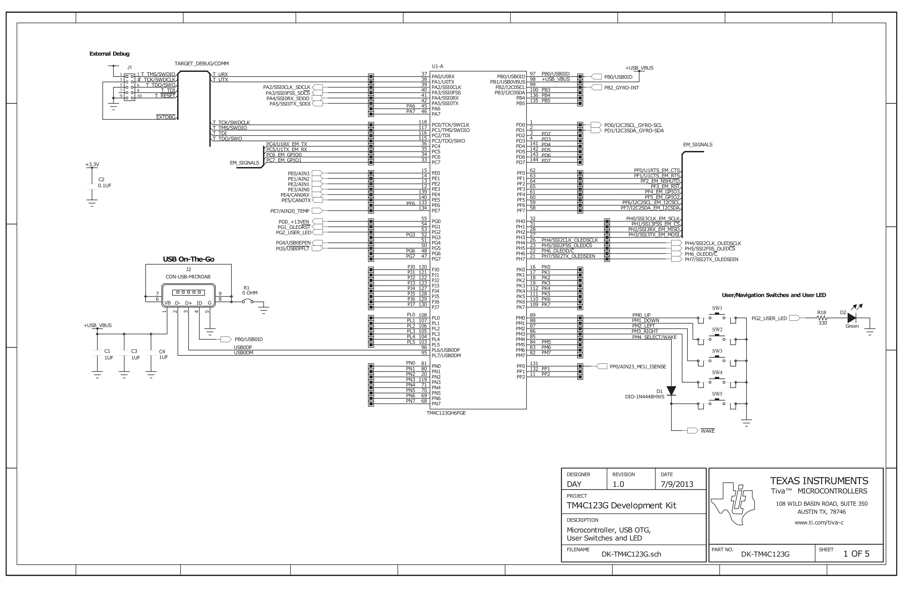

## Task A1
Just follow the [instructions from the lab](./ItES-lab1.pdf) to load up the qs-logger project  
Hint for the graphs: gyroscope isn't the same as accelerometer, one is the derivative of the other

## Task A2 -> E
Load up project project (lol)  
`git checkout` the history

## Task F
I didn't have time to do this :(

## Microcontroller schematic
### (Page 26 of Kit Users' Guide)
(See how User LED and the buttons are connected to the controller)  

